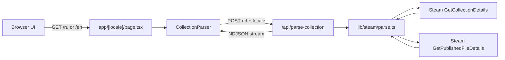

# Workshop Collection Parser

A web utility for **Project Zomboid** server admins. Paste a Steam Workshop collection URL and get ready-to-copy `WorkshopItems=` and `Mods=` values for your server config.

**Live app:** [workshop-parser.thebeet.dev](https://workshop-parser.thebeet.dev)

## Features

- Parses Steam Workshop collection URLs or bare numeric collection IDs
- Recursively expands nested collections
- Fetches workshop item metadata from Steam's public API
- Extracts Project Zomboid `Mod ID:` values from mod descriptions
- Streams parsing progress to the UI (collection resolution, then mod lookup)
- De-duplicates workshop IDs and mod IDs while preserving collection order
- Surfaces warnings for items that need manual review (missing Mod ID, multiple Mod IDs, unavailable items)
- Localized UI in Russian and English

## How to Use

1. Open the app at [workshop-parser.thebeet.dev](https://workshop-parser.thebeet.dev) (or run it locally).
2. Paste a Steam Workshop collection link, for example:
   ```
   https://steamcommunity.com/sharedfiles/filedetails/?id=2490220997
   ```
   A bare numeric ID is also accepted.
3. Click **Parse** and wait for the progress bar to finish.
4. Copy the generated lists or full config lines:
   - `WorkshopItems=<id1>;<id2>;...`
   - `Mods=<modId1>;<modId2>;...`
5. Review any warnings before applying the config to your server.

The collection must be **public**. Private, hidden, banned, or deleted items are reported as warnings and may be skipped from the Mod ID list.

## Tech Stack

| Area            | Technology                                    |
| --------------- | --------------------------------------------- |
| Framework       | [Next.js](https://nextjs.org) 16 (App Router) |
| UI              | React 19, Tailwind CSS v4                     |
| Language        | TypeScript 5                                  |
| i18n            | [next-intl](https://next-intl.dev)            |
| Package manager | [pnpm](https://pnpm.io) 11.10.0               |
| Linting         | ESLint (`@antfu/eslint-config`)               |
| Git hooks       | Husky + lint-staged                           |

The parse API route runs on the **Node.js runtime** (not Edge) because it performs server-side HTTP calls to Steam.

## Prerequisites

- **Node.js 24.x** (matches CI)
- **pnpm 11.10.0** — pinned in `package.json`; use Corepack to install the correct version:

```bash
corepack enable
```

## Getting Started

```bash
# Install dependencies
pnpm install

# Start the development server
pnpm dev
```

Open [http://localhost:3000](http://localhost:3000). The app redirects to the default locale (`/en`). Available locales:

- `/ru` — Russian
- `/en` — English (default)

### Production Build

```bash
pnpm build
pnpm start
```

### Lint

```bash
pnpm lint
pnpm lint:fix
```

Pre-commit hooks run `lint-staged`, which lints staged files via `pnpm lint`.

## Project Structure

```
app/
  [locale]/           # Localized pages (home UI)
  api/
    parse-collection/ # POST endpoint — NDJSON streaming parser
components/
  collection-parser.tsx   # Form, progress bar, results table
  language-switcher.tsx   # Locale switcher
i18n/                 # next-intl routing, messages loader, navigation helpers
lib/steam/
  collection.ts       # Collection ID extraction, nested collection resolution
  mod-details.ts      # Batch mod lookup, Mod ID regex extraction
  parse.ts            # Full parsing pipeline orchestration
  types.ts            # Shared types (ParseResult, stream events, warnings)
messages/             # Translation JSON (en.json, ru.json)
proxy.ts              # Locale routing middleware (next-intl)
```

There is no database, authentication, or persistent storage. The app is a stateless utility.

## API

### `POST /api/parse-collection`

Parses a Steam Workshop collection and returns a **newline-delimited JSON (NDJSON)** stream.

**Request body:**

```json
{
  "url": "https://steamcommunity.com/sharedfiles/filedetails/?id=1234567890",
  "locale": "en"
}
```

| Field    | Type             | Required | Description                                           |
| -------- | ---------------- | -------- | ----------------------------------------------------- |
| `url`    | `string`         | yes      | Collection URL or numeric ID                          |
| `locale` | `"ru"` \| `"en"` | no       | Locale for error/progress messages (defaults to `en`) |

**Validation errors** (before streaming starts) return plain JSON:

```json
{ "error": "Provide a link to a Steam Workshop collection." }
```

HTTP status: `400` for invalid input.

**Successful parse** returns `Content-Type: application/x-ndjson` with one JSON object per line:

```json
{"type":"progress","progress":{"phase":"collection","loaded":0,"total":0,"message":"Fetching the list of mods from the collection…"}}
{"type":"progress","progress":{"phase":"mods","loaded":50,"total":120,"message":"Reading mod data (50 of 120)…"}}
{"type":"result","result":{"collectionId":"1234567890","workshopIds":["..."],"modIds":["..."],"entries":[],"warnings":[]}}
```

**Stream event types:**

| Type       | Payload         | Description                                                 |
| ---------- | --------------- | ----------------------------------------------------------- |
| `progress` | `ParseProgress` | Incremental status update (`phase`: `collection` or `mods`) |
| `result`   | `ParseResult`   | Final parsed data                                           |
| `error`    | `error: string` | Terminal error message (invalid URL, Steam failure, etc.)   |

**`ParseResult` shape:**

```typescript
{
  collectionId: string;
  workshopIds: string[];   // for WorkshopItems=
  modIds: string[];       // for Mods= (de-duplicated)
  entries: ModEntry[];    // per-mod breakdown in collection order
  warnings: ParseWarning[]; // items needing manual review
}
```

**Warning reasons:**

| Reason             | Meaning                                                    |
| ------------------ | ---------------------------------------------------------- |
| `no-mod-id`        | No `Mod ID:` found in the workshop description             |
| `multiple-mod-ids` | More than one Mod ID found — pick the ones you need        |
| `unavailable`      | Item is hidden, banned, deleted, or otherwise inaccessible |

## Architecture



**Parsing pipeline:**

1. **Extract collection ID** from URL or accept a bare numeric ID.
2. **Resolve collection tree** — call `ISteamRemoteStorage/GetCollectionDetails/v1/`, follow nested collections recursively, collect ordered workshop item IDs.
3. **Fetch mod details** — batch-call `ISteamRemoteStorage/GetPublishedFileDetails/v1/` (50 items per request).
4. **Extract Mod IDs** — regex match `Mod ID:` in each description (BBCode tags stripped).
5. **Build result** — de-duplicate mod IDs, generate warnings, stream progress events.

All Steam calls use public endpoints with **no API key**.

## Steam API Limitations

This tool depends entirely on Steam's public Web API and workshop page metadata. Keep these constraints in mind:

- **No API key, no authentication** — requests use unauthenticated public endpoints. Steam may rate-limit or block requests under heavy load.
- **Public collections only** — private or restricted collections return empty or incomplete results.
- **Mod ID is not a Steam field** — Mod IDs are parsed from free-text workshop descriptions using the `Mod ID:` pattern. If an author omits it, uses a non-standard format, or puts it only in an image, the parser cannot detect it.
- **Multiple Mod IDs** — some workshop items bundle several mods. All found IDs are included, and a warning is raised so you can choose the correct ones.
- **Unavailable items** — banned, deleted, or hidden mods are flagged but still listed with their workshop ID.
- **Network dependency** — parsing fails if Steam is unreachable or returns a non-2xx HTTP status.
- **No caching** — every parse makes fresh requests to Steam (`cache: "no-store"`).

There is no retry logic or backoff. If parsing fails due to a transient Steam error, try again after a short wait.

## Internationalization

Locales are configured in `i18n/routing.ts`:

- `ru` — default
- `en`

Translation files live in `messages/`. The API accepts a `locale` field so error and progress messages match the UI language. Locale routing is handled by `proxy.ts` (next-intl middleware).

## CI

Pull requests to `main` run lint on GitHub Actions:

- Runner: `ubuntu-latest`
- Node.js: `24.x`
- Steps: `pnpm install` → `pnpm lint`

See [`.github/workflows/lint.yaml`](.github/workflows/lint.yaml).

There is no automated test suite in this repository.

## Deployment

Standard Next.js deployment:

```bash
pnpm build
pnpm start
```

The parse route requires the **Node.js runtime** (`export const runtime = "nodejs"`). Edge-only deployment will not work for the parser API.

The production instance is hosted at [workshop-parser.thebeet.dev](https://workshop-parser.thebeet.dev).

## Troubleshooting

| Problem                                   | Likely cause                                        | What to do                                          |
| ----------------------------------------- | --------------------------------------------------- | --------------------------------------------------- |
| "Could not recognize the collection link" | Invalid URL format                                  | Use a full Steam collection URL or a numeric ID     |
| "Collection not found or empty"           | Private/deleted collection or wrong ID              | Verify the link in a browser while logged out       |
| "Could not reach Steam"                   | Network issue or Steam outage                       | Check connectivity and retry                        |
| Mod ID missing for a specific mod         | Author did not include `Mod ID:` in the description | Open the workshop page and copy the Mod ID manually |
| Multiple Mod IDs warning                  | Workshop item contains several mods                 | Pick the Mod IDs you actually need                  |
| Slow parsing on large collections         | Many workshop items = multiple batched API calls    | Expected behavior; wait for the progress bar        |

## License

Private project. See repository settings for license details.

---

Built by [Serhii Buriak](https://thebeet.dev) · [GitHub](https://github.com/thedarkbeet/workshop-parser)
